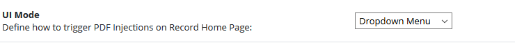

## Documentation
PDF Injector is a REDCap module that enables you to populate fillable PDFs with record data from variables. 


Documentation Overview:

1. [Installation](#installation)
2. [Configuration](#configuration)
3. [How to use](#how-to-use)
4. [Requirements and Limitations](#requirements-and-limitations)
5. [Known Issues](#known-issues)


### Installation

*Important:* Please read [Requirements and Limitations](#requirements-and-limitations) before your proceed to setup and use the module!

**Install automatically from REDCap Repo**<br>
You can download and install the latest version of PDF Injector from [REDCap Repository of External Modules](https://redcap.vanderbilt.edu/consortium/modules/). If you open the Repo link from your REDCap instance, than automatic install will be triggered.

**Install manually from Github Repository**<br>
You can download the latest release of the module from its [releases page](https://github.com/tertek/redcap-pdf-injector/releases). Pleas ensure to download the pre-composed .zip file (*redcap-pdf-injector-vX.X.X.zip*), otherwise you have to run `composer install --no-dev` before installing on your server. To install the module on your server upload the unzipped module folder to /modules/ within your redcap instance.

After successfully installing the module you should be able to enable the module through Control Center on system level.

### Configuration


**Enable Debugging**<br>If you have problems with the module you can output javascript console logs.


**Set UI Mode**<br>To define how your Injections should be displayed on the Record Home Page, choose the option in module configuration that suits you best.



**Set Preview Mode**<br>
You can choose in module configuration settings how the filled PDF should be previewed on the record page: either within a modal or in a new tab. Previewing in a new tab has the advantage that you can configure your browser to directly open the PDF in Adobe Reader, that enhances given browsers issues as described below. <br>[Learn here how to configure Firefox to chose another viewer for PDFs](https://support.mozilla.org/en-US/kb/view-pdf-files-firefox-or-choose-another-viewer).


### How to use

**Add a new Injection**<br>
You can add a new PDF Injection as follows:

1. Click on "Add new Injection"


2. A modal opens up where you can add your new Injection


2.1 Upload your PDF that [satisfies given limitations](#requirements-and-limitations)
2.2 Add your title and description.
2.3 Bind variables to given form fields.

Repeat this for any other PDF file.

*Hint* If you would like to fill multiple variables into a form field, you can use CALCTEXT inside the field annotation of that field. PDF Injector can handle fields with CALCTEXT and also in combination with Smart Variables and Action Tags*.

**Preview Injection**<br>

**Download Injection**<br>

### Requirements and Limitations
Please notice that the current module version has several requirements. Ensure to test your setup before use in production.

**Requirement 1: form fields**<br>
The PDF has to have form fields that can be filled (otherwise you will only output an unfilled PDF). It is recommened to use Software such as "Adobe Acrobat Pro" to create PDFs with form fields. <br>[Learn here how to create fillable pdf forms](https://acrobat.adobe.com/us/en/acrobat/how-to/create-fillable-pdf-forms-creator.html).

**Requirement 2: readable and fillable**<br>
To make the PDF and its fields readable & fillable through PDF Injector we have to process the pdf with an open source tool called `pdftk`.
<u>If you do not do this step, PDF Injector will not be able to scan your document and read the fields or fill them!</u>

*There are two ways of processing your PDFs with pdftk:*

a. Use the [pdfk web service](https://pdftk-web-service.herokuapp.com/) to upload, convert and download your PDF. Alternatively, you can setup the pdftk web service on your own server/localhost. <br>[Get repo to setup pdftk web service](https://github.com/tertek/pdftk-web-service)

b. Use [pdftk](https://www.pdflabs.com/tools/pdftk-server/) for your system and run:

```
    $ pdftk document.pdf output document_converted.pdf
    //  Check pdftk docs for further help
```

**Limitation 1: PDF field types**<br>
Currently the following PDF field types are supported:
- Textfield: Insert text as one line or also as multiline (option multline for textfield has to be active)
- Checkbox: Insert a value that is true or false to tick or untick the checkbox.

**Limitation 2: REDCap Action Tags**<br>
Currently the following Action Tags are supported during an injection:
- @TODAY: returns date in format "d.m.Y"


### Known Issues

**Firefox**<br>
"This PDF document might not be displayed correctly.":  Direct printing within Mozilla Firefox PDF Preview is currently not possible. To ensure proper displaying &  printing please download the file and open in Adobe Acrobat or use Chrome Browser.